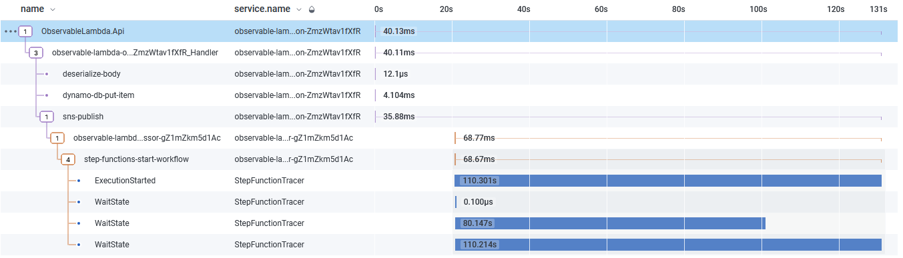

# .NET Lambda Observability

Observability is an important part of serverless applications. As the levels of decomposition get smaller tracing and structured logging become all the more important.

This repository contains examples of tracing using Native AWS services and tooling, Open Telemetry and AWS Lambda PowerTools. Links to individual repositories can be found below:

- [Native AWS](./src/NativeAWS/README.md)
- [Open Telemetry & Honeycomb](./src/OTEL/README.md)
- [Lambda PowerTools](./src/PowerTools/)