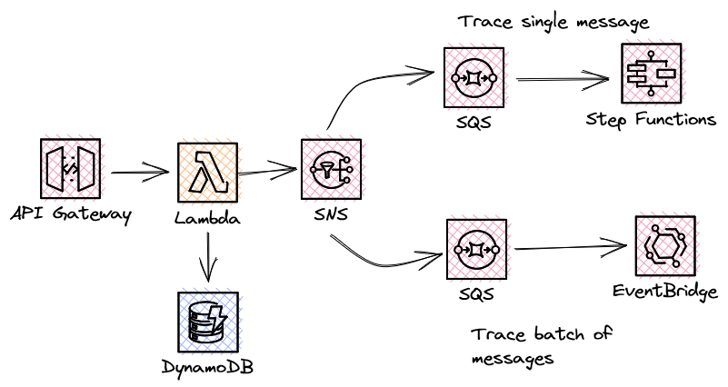

**IMPORTANT! This code is not ready for use in production**

# Tracing with Open Telemetry

The examples here cover how to trace your serverless applications using Open Telemetry.



The sample application takes a user creation request from API Gateway, stores the user in DynamoDB and then publises a message to SQS.

These SQS queue is configured to trigger a Lambda function. The Lambda function then processes the message, simulating the work using a 5 second delay.

All of the OpenTelemetry setup and processing logic is moved into a `Serverless.OpenTelemetry` package.

The Lambda function IAM role needs to have `osis:Ingest` permissions for the ARN of the Ingestion pipeline resource, an example of this can be seen in the SAM template.

The .NET OpenTelemetry exporter uses a HttpRequestHandler to SigV4 sign the requests being sent to the OpenSearch Ingestion Pipeline endpoint.

``` c#
namespace Serverless.OpenTelemetry;

using Amazon.Runtime;
using Amazon.Util;

using AwsSignatureVersion4.Private;

public class SignedRequestHandler : DelegatingHandler
{
    private static readonly KeyValuePair<string, IEnumerable<string>>[] EmptyRequestHeaders =
        Array.Empty<KeyValuePair<string, IEnumerable<string>>>();

    public SignedRequestHandler()
    {
        this.InnerHandler = new HttpClientHandler();
    }

    /// <inheritdoc/>
    protected override async Task<HttpResponseMessage> SendAsync(
        HttpRequestMessage request,
        CancellationToken cancellationToken)
    {
        RemoveHeaders(request);

        var credentials = new ImmutableCredentials(
            // These environment variables are set by the Lambda environment and do not need to be passed to the function
            // They will not be visible in the Lambda console, or by the application
            // DO NOT write them to logs.
            Environment.GetEnvironmentVariable("AWS_ACCESS_KEY_ID"),
            Environment.GetEnvironmentVariable("AWS_SECRET_ACCESS_KEY"),
            Environment.GetEnvironmentVariable("AWS_SESSION_TOKEN"));

        await Signer.SignAsync(
            request,
            null,
            null,
            DateTime.Now,
            Environment.GetEnvironmentVariable("AWS_REGION"),
            "osis",
            credentials);

        return await base.SendAsync(
                request,
                cancellationToken)
            .ConfigureAwait(false);
    }

    protected override HttpResponseMessage Send(
        HttpRequestMessage request,
        CancellationToken cancellationToken)
    {
        RemoveHeaders(request);

        var credentials = new ImmutableCredentials(
            // These environment variables are set by the Lambda environment and do not need to be passed to the function
            // They will not be visible in the Lambda console, or by the application
            // DO NOT write them to logs.
            Environment.GetEnvironmentVariable("AWS_ACCESS_KEY_ID"),
            Environment.GetEnvironmentVariable("AWS_SECRET_ACCESS_KEY"),
            Environment.GetEnvironmentVariable("AWS_SESSION_TOKEN"));

        Signer.Sign(
            request,
            null,
            null,
            DateTime.Now,
            Environment.GetEnvironmentVariable("AWS_REGION"),
            "osis",
            credentials);

        return base.Send(
            request,
            cancellationToken);
    }

    /// <summary>
    /// Given the idempotent nature of message handlers, lets remove request headers that
    /// might have been added by an prior attempt to send the request.
    /// </summary>
    private static void RemoveHeaders(HttpRequestMessage request)
    {
        request.Headers.Remove(HeaderKeys.AuthorizationHeader);
        request.Headers.Remove(HeaderKeys.XAmzContentSha256Header);
        request.Headers.Remove(HeaderKeys.XAmzDateHeader);
        request.Headers.Remove(HeaderKeys.XAmzSecurityTokenHeader);
    }
}
```

## Pre Requisites
- .NET 6
- AWS SAM CLI
- An AWS account
- A configured OpenSearch domain
- A configured OpenSearch ingestion pipeline
  - Details on deploying the [OpenSearch Ingestion Pipeline is available on the AWS docs](https://docs.aws.amazon.com/opensearch-service/latest/developerguide/configure-client-otel.html). This example also includes an example OpenTelemetry collector configuration. This Lambda examples uses SigV4 auth to send trace data direct to the ingestion endpoint.

## Deployment

To deploy this into your own AWS account use the below commands:

``` bash
sam build
sam deploy --guided
```

When running SAM deploy you will need to provide a HONEYCOMB_API_KEY for the traces to be exported.

## Testing

An API endpoint will be output after SAM successfully deploys the application. Make a POST request to the endpoint using the below request body. The email address used can be any valid string.

In the API response you will receive a 'traceparent' property in the body. This contains the trace id that you can then use to search the Honeycomb UI. 